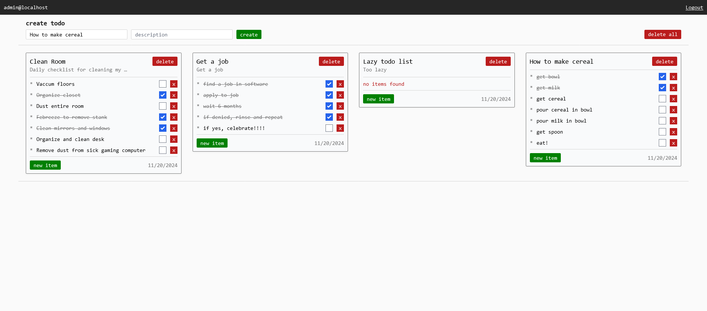

# TODO CRUD Web Application (Go, HTMX, Templ, TailwindCSS)



### Overview

This project is a fully functional web application built with the **Go** programming language, emphasizing backend-driven development. It showcases a simple yet powerful **CRUD (Create, Read, Update, Delete)** implementation, utilizing modern tools for streamlined development.

### Features

- **User Authentication**: Account registration, login, and session management.
- **CRUD Operations**: Manage todos via a fully implemented backend.
- **Custom HTTP Server**: Built from scratch with Go’s `http` package, showcasing custom handlers and endpoints for all HTTP verbs.
- **Database Integration**:
  - PostgreSQL for storing users, todos, and session data.
  - Optimized queries and data validation.
- **Modern Web Development Tools**:
  - **HTMX**: For dynamic client interactions and partial HTML updates without full page reloads.
  - **Templ**: Simplified HTML templating for organized and maintainable code.
  - **TailwindCSS**: Rapid UI development with minimal custom CSS.

### Key Objectives

1. Leverage **Go** to implement a backend-focused web application with minimal reliance on frontend frameworks.
2. Demonstrate backend functionality, including:
   - Endpoints covering all HTTP verbs (GET, POST, PUT, DELETE).
   - Secure session handling.
   - Integration with a relational database (PostgreSQL).
3. Provide a maintainable, scalable structure for future improvements.

### Current Progress

- Built with the **chi router** for cleaner routing and middleware support.
- Plans to migrate routing to Go’s standard `http` package for deeper understanding and flexibility.
- Includes foundational functionality with opportunities for cleanup and optimization.

### How to Run

1. **Clone the repository**:
   ```bash
   git clone https://github.com/your-username/your-repo.git
   cd your-repo
   ```
2. **Set up PostgreSQL**:
   - Create a database and update connection details in the configuration file. I used Docker.
3. **Run the application**:
   ```bash
   go run main.go
   ```
4. **Access the application**:
   - Open a web browser and navigate to `http://localhost:8080`.

### Technologies Used

- **Backend**: Go, chi router (future migration to `http`).
- **Frontend**: HTMX, Templ, TailwindCSS.
- **Database**: PostgreSQL.

### Future Plans

- Fully migrate from **chi router** to Go’s standard `http` package.
- Refactor and optimize code for better maintainability.
- Add additional features such as:
  - Password recovery.
  - Advanced filtering and search for todos.
  - Improved test coverage.
